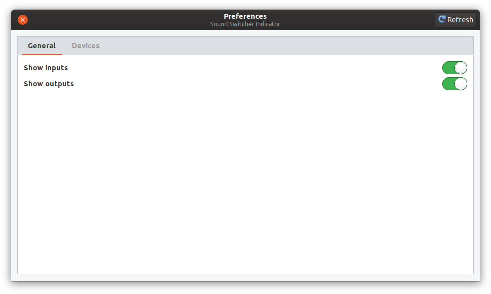
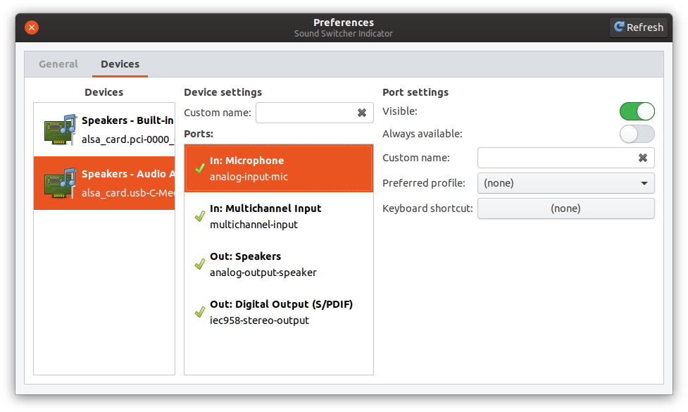

# Sound Switcher Indicator: Configuration

## Preferences dialog

Most aspects of the indicator can be configured using the *Preferences…* menu item which opens the corresponding dialog.

### General tab

Allows for hiding input and/or output sections from the menu.



### Devices tab

Makes it possible to change the way how and whether devices and their ports are displayed. The *Refresh* button in the top right corner reloads the *Devices* and the *Ports* lists.




## Configuration file

The indicator can also be configured by using a [JSON](https://en.wikipedia.org/wiki/JSON) configuration file, whose default location is `~/.config/indicator-sound-switcher.json`.

When editing the configuration file, make sure the indicator application isn't running, because the file will be overwritten otherwise!

If this file is present, the following items can be configured:

| Name                    | Type    | Default | Description                                                                   |
|-------------------------|---------|---------|-------------------------------------------------------------------------------|
| `show_inputs`           | boolean | true    | Whether to show the "Inputs" section (and all the input ports) in the menu.   |
| `show_outputs`          | boolean | true    | Whether to show the "Outputs" section (and all the output ports) in the menu. |
| `devices`               | object  |         | Provides configuration items for a specific device.                           |
| `devices`/(name)/`name` | string  |         | Allows to use a different display name for the device.                        |
| `devices`/(name)/`ports`| object  |         | Provides configuration items for the device's ports.                          |

The `devices` object contains configuration objects for each device. The name to be used is the PulseAudio's card name, which can be seen in the debug output of `indicator-sound-switcher -vv`. In the below example it's `alsa_card.pci-0000_00_08.0`:

    DEB   + Card[0] added: `alsa_card.pci-0000_00_08.0`

The `ports` object of the device configuration allows to further configure a specific device port in the menu. Likewise, the port's name can be found in the debug output, for example:

    DEB     + Card port added: `analog-output-speaker` (`Speakers`); priority: 10000; direction: 1; available: No

Here `analog-output-speaker` is the port name and `Speakers` is what will be displayed in the menu by default.

The configuration of the port is an object providing the following elements (all are optional):

| Name                    | Type    | Default | Description                                                                                                 |
|-------------------------|---------|---------|-------------------------------------------------------------------------------------------------------------|
| `visible`               | boolean | true    | Whether the corresponding menu item is visible.                                                             |
| `name`                  | string  |         | Alternative display name for the port (menu item text).                                                     |
| `preferred_profile`     | string  |         | Profile name to switch to by default when the menu item is selected. If not given, and the currently selected profile doesn't support this port, a profile with the maximum priority will be picked. |
| `always_available`      | boolean | false   | If `true`, the corresponding menu item will be displayed disregarding whether or not the port is available. |
| `shortcut`              | string  |         | Global keyboard shortcut for switching to this port                                                         |

Here's a sample configuration file:

```JSON
{
    "show_inputs": false,
    "show_outputs": true,
    "devices": {
        "alsa_card.pci-0000_00_06.0": {
            "name": "My lovely card",
            "ports": {
                "analog-output-speaker": "Boombox",
                "iec958-stereo-output": false,
                "analog-input-microphone": {
                    "name": "Mike",
                    "preferred_profile": "output:analog-stereo+input:analog-stereo",
                    "always_available": true,
                    "shortcut": "<Primary><Alt>7"
                }
            }
        },
        "alsa_card.pci-0000_01_00.1": {
            "name": "HDMI Audio"
        },
        "virtual": {
            "sinks": {
                "combined": "All at once",
                "network": {
                    "name": "Kitchen computer"
                }
            }
        }
    }
}
```

It says that:

* The `Inputs` section will be hidden.
* The device `alsa_card.pci-0000_00_06.0` will be referred to as `My lovely card`, and
    * Its speaker output will be called `Boombox`,
    * Its S/PDIF port will be hidden from the menu,
    * Its microphone input will be called `Mike`, activate the duplex (input+output) profile when selected, and be shown even when isn't available. You can switch to it using the `Ctrl+Alt+7` key combo.
* The device `alsa_card.pci-0000_01_00.1` will be named `HDMI Audio` in the menu items.
* For the rest all the defaults will apply.
